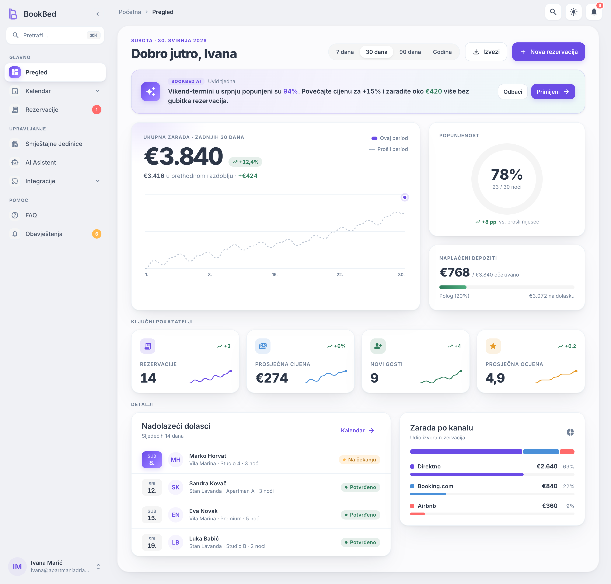
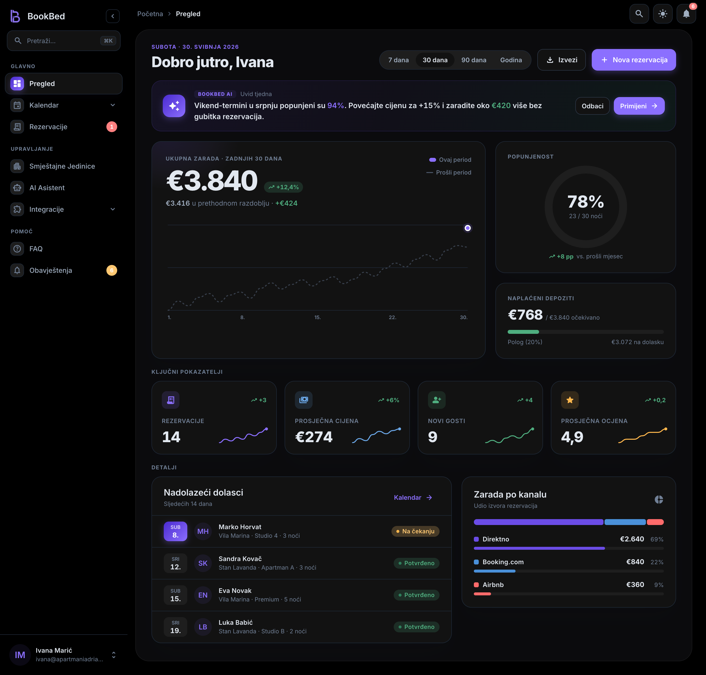
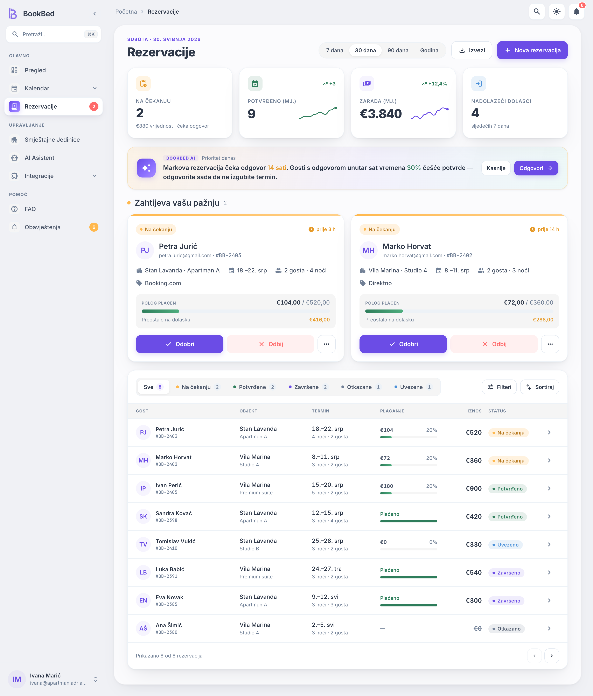
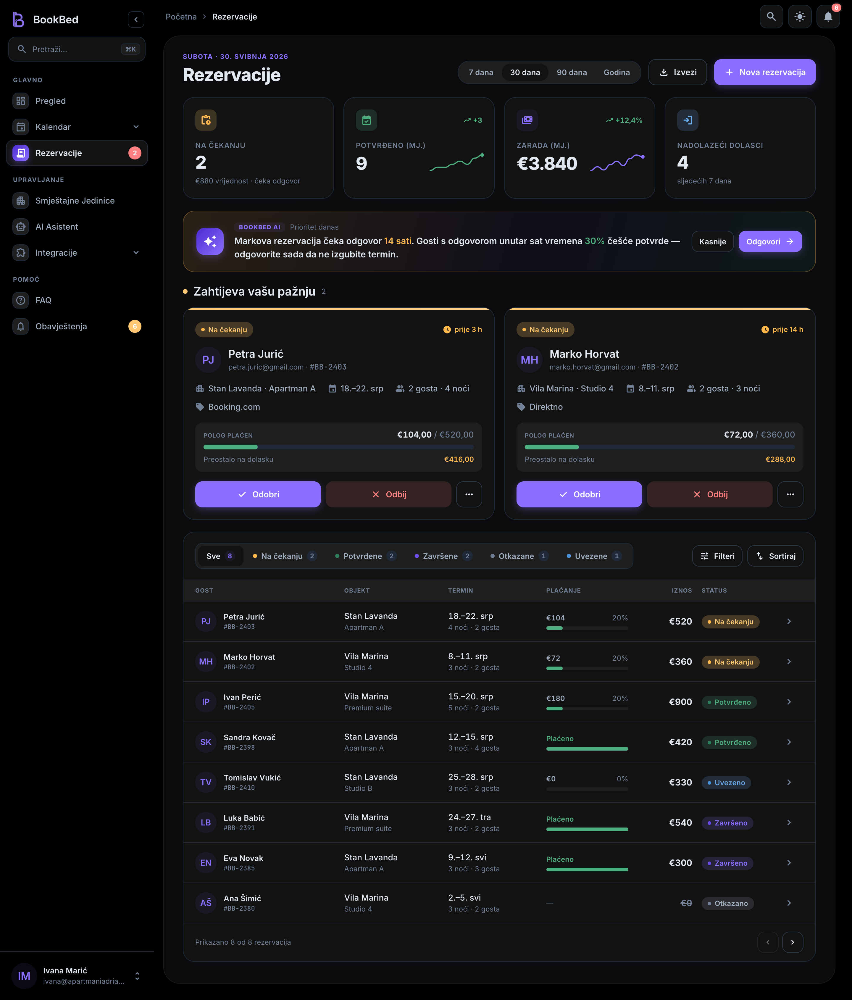
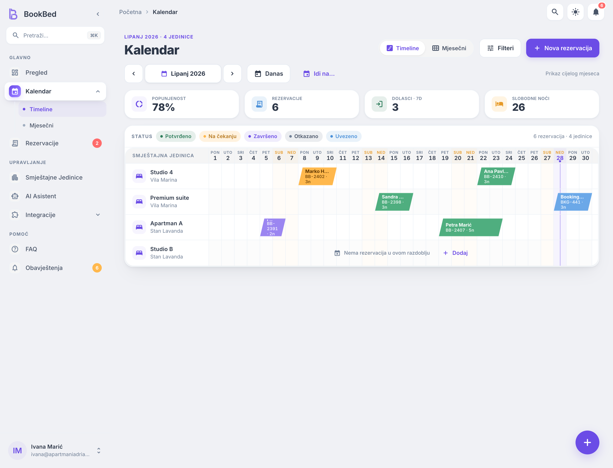
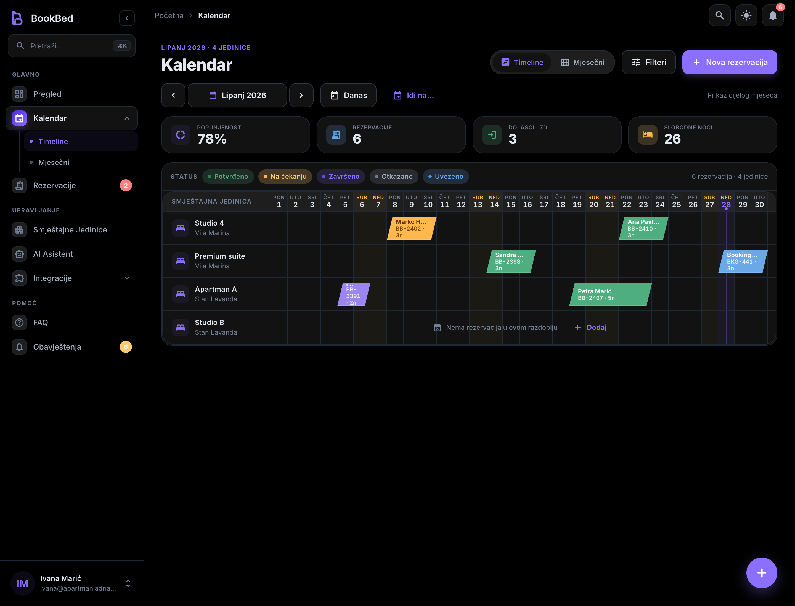

# audit/127 — Handoff Design System (color / surface / background / elevation) vs app

**Date:** 2026-06-16 · **Type:** READ-ONLY audit (no code, no commit) · **Scope:** GLOBAL color/surface SYSTEM (light + dark)
**Method:** 3 Explore agents + firsthand reads of `design_handoff/source/tokens.css`, `lib/core/theme/app_gradients.dart`, `gradient_extensions.dart`, `app_theme.dart`, `lib/core/design/{tokens,bb_redesign_tokens}.dart` + live handoff renders (Babel harness, `*-premium.jsx`). Every hex below is quoted from source this session.

## Why this exists

The fidelity campaign polished screens one-by-one (audit/124) and chrome structure (audit/126), but **never systematized the color/surface/background/elevation SYSTEM itself** — page bg, surfaces/cards, header, banner, drawer, borders, shadows, text — as one coherent thing, light + dark, against the handoff. The operator's read: the result looks **incoherent ("Frankenstein")**. This doc extracts the handoff system as ground truth, renders it as the visual target, maps where the app diverges, and specs a coherent adoption with exact hex. **Changes no code; the recommended palette is a spec for a later apply PR.**

> Note vs audit/126: that doc described page bg as a TIP-1 *gradient*. CL 7.23 (`flat-chrome-decision.md`, same day, after 126) **flattened** owner chrome — `app_gradients` page/section now render as solid fills. This audit reflects the current FLAT state and is about **VALUES**, not gradient-vs-flat (flat stays).

### Thesis (one line)
**Three parallel background/surface token sources run at once and disagree on the grays.** `app_gradients` (what most owner Scaffolds actually paint) drifted off-palette; in dark it inverts elevation (page lighter than the cards on it). Two of the three sources already match the handoff — only `app_gradients` drags the app off. Fix = re-point `app_gradients` values to the handoff ladder.

---

## §1 — Handoff system (GROUND TRUTH)

Source: `design_handoff/source/tokens.css`. Class-based theming (`.theme-light` default `:root`, `.theme-dark` override). Surfaces/borders — the focus of this audit:

| Role | Light | Dark | Token |
|---|---|---|---|
| page bg (standard screens) | `#FAFAFA` | `#000000` | `--bb-bg` |
| surface / **card** | `#FFFFFF` | `#121212` | `--bb-surface` |
| surface-variant (chips/input/tabs) | `#F5F5F5` | `#1E1E1E` | `--bb-surface-variant` |
| surface-elevated (modals/popovers) | `#FFFFFF` | `#1A1A1A` | `--bb-surface-elevated` |
| border | `#E2E8F0` | `#2D3748` | `--bb-border` |
| border-subtle / divider | `#EDF2F7` | `#1F2937` | `--bb-border-subtle` / `--bb-divider` |
| **shell** (premium console L1) | `#F0F1F5` | `#000000` | `--bb-shell-bg` |
| **panel** (premium console L2) | `#FBFBFD` | `#0B0B0D` | `--bb-panel-bg` |
| panel-border | `rgba(20,24,45,.05)` | `rgba(255,255,255,.06)` | `--bb-panel-border` |

**Text** (both already match the app): primary `#2D3748`/`#E2E8F0`, secondary `#4A5568`/`#A0AEC0`, tertiary `#718096`/`#718096`, on-primary `#FFFFFF`.

**Brand / status** (already aligned in `tokens.dart`): primary `#6B4CE6`/`#8B6FFF`; confirmed `#2E7D5B`/`#4FAE7F`, pending `#B7791F`(AA)/`#FFC872`, cancelled `#4A5568`/`#A0AEC0`, completed `#6B4CE6`/`#8B6FFF`, imported `#4A90D9`/`#6BA8E8`. Gradients used **only** for brand/hero accents (`--bb-gradient-primary` 135° `#6B4CE6`→`#8B6FFF`; `--bb-gradient-hero` 3-stop) — **never page/surface**.

**Shadow ramp** (cool-toned, 3-layer; stronger in dark to register): `--bb-shadow-sm/md/lg/card` + `--bb-shadow-purple` glow + `--bb-panel-shadow` (premium floating panel). Full values in §6.

### Composition / semantic layering (the key logic)
- **Standard screens (2 layers):** page `--bb-bg` → cards `--bb-surface`.
- **Premium console (3 layers):** shell `--bb-shell-bg` (L1 — sidebar + app bar dissolve into it, `tokens.css:294-298`) → floating panel `--bb-panel-bg` (L2 — rounded, soft `--bb-panel-shadow`) → cards `--bb-surface` (L3).
- **Monotonic by lightness, both themes** — a card is **always lighter** than the surface beneath it:
  - light: `#F0F1F5` < `#FBFBFD` < `#FFFFFF`
  - dark: `#000000` < `#0B0B0D` < `#121212` < `#1E1E1E`
- **Elevation = lightness step + 1px cool border.** Shadows are the *accent*, not the structure — critical in flat dark: on `#000`, shadows are invisible, so the **lightness ladder IS the elevation cue**.
- **Borders cool, low-chroma** (`#E2E8F0` / `#2D3748`) — not warm/purple.

---

## §2 — Handoff RENDERS (the visual TARGET)

Rendered live from `design_handoff/source/` (`pregled-premium`, `rezervacije-premium`, `calendar-*`), 1440px desktop, light + dark. This is the reference the operator said was missing — confirm "this is good," then the app aims at it.

### Pregled (Dashboard)
Light — shell `#F0F1F5` gutter → panel `#FBFBFD` → white `#FFFFFF` cards. Calm, clearly layered.

Dark — **OLED ladder**: black `#000` shell → `#0B0B0D` panel → `#121212` cards. Each layer lighter than the one beneath; cards never sink.

### Rezervacije (Bookings)

### Kalendar (Timeline)

> Render method (reproducible): `python3 -m http.server` in `design_handoff/source/`, open `BookBed Design.html`, clone the target `.bb-screen` artboard into an isolated host, swap `.theme-light`↔`.theme-dark`, full-page screenshot. Toggling the class re-resolves all `--bb-*` tokens automatically.

---

## §3 — App CURRENT state (the 3-system map)

The smoking gun — three sources, three answers for the same roles (all firsthand):

| Source | Light page | Dark page | Light card | Dark card | Border L / D |
|---|---|---|---|---|---|
| **Handoff (truth)** | `#FAFAFA` bg / `#F0F1F5` shell | `#000000` | `#FFFFFF` (panel `#FBFBFD`) | `#121212` (panel `#0B0B0D`) | `#E2E8F0` / `#2D3748` |
| `app_theme.dart` (Material) | `#F0F1F5` | `#000000` | `#FFFFFF` | `#121212` | — (theme) |
| `BbRedesignTokens` (`rd.*`) | shell `#F0F1F5` / panel `#FBFBFD` | `#000000` / panel `#0B0B0D` | — | — | panelBorder rgba |
| **`app_gradients`** ← scaffolds paint this | **`#ECEDF2`** / section `#FFFFFF` | **`#1A1A1A`** / section `#2D2D2D` | `#FBFBFD` | **`#2D2D2D`** | `#E0DCE8` / `#35323D` |

`app_theme` and `rd.*` already match the handoff. **`app_gradients` is the outlier** — and it is the layer most owner screens actually paint their Scaffold body with (`context.gradients.pageBackground`).

### Per element (current, with citations)
- **Page bg** = `context.gradients.pageBackground` → light `#ECEDF2`, dark `#1A1A1A` (`app_gradients.dart:66-72`). Painted at `dashboard_overview_tab.dart:59` + ~19 owner screens + drawer body (`owner_app_drawer.dart:35`).
- **Premium floating panel** = `rd.panelBg` → `#FBFBFD` / `#0B0B0D` (`bb_redesign_tokens.dart`; `dashboard_overview_tab.dart:436-444`). ✓ matches handoff.
- **Cards** = two competing answers: Material `cardColor` `#FFFFFF`/`#121212` (`app_theme.dart:99,505`) **vs** `context.gradients.cardBackground` `#FBFBFD`/`#2D2D2D` (`app_gradients.dart:91-92`).
- **AppBar** = theme `#F0F1F5`/`#000000` (`app_theme.dart:74,480`). ✓ matches handoff shell.
- **Drawer** = body `context.gradients.pageBackground` (`#ECEDF2`/`#1A1A1A`), header `rd.shellBg` (`#F0F1F5`/`#000`), `drawerTheme` `#FFFFFF`/`#121212` — three different bases in one widget (`owner_app_drawer.dart:35,230-235` + `app_theme.dart:289,692`).
- **Banner** = `trial_banner.dart` warning/error tint over surface (`#FFB84D`/`#FF6B6B` @ ~12% light / ~16% dark). ✓ semantically fine.
- **Headers** = `bookings_premium_header.dart` `BbCard` + hero/tertiary accents. ✓.
- **Borders** = `app_gradients.sectionBorder` `#E0DCE8`/`#35323D` (`app_gradients.dart:84-85`) — warm-drifted vs handoff cool `#E2E8F0`/`#2D3748`.

---

## §4 — Gap analysis (why it reads as Frankenstein)

1. **Three disagreeing light page grays:** `#ECEDF2` (app_gradients) ≠ `#F0F1F5` (Material + rd) ≠ `#FAFAFA` (handoff). None match.
2. **Dark inverted elevation (the worst offender):** page `#1A1A1A` is **lighter** than the panel `#0B0B0D` and cards `#121212` that sit on it → cards visually *sink below* the page. The code admits it (`app_gradients.dart:88-90`: "the old `#0B0B0D` sank BELOW it and dissolved") and hacks cards up to `#2D2D2D` to escape — and **`#2D2D2D` is not any handoff dark token.** Net: **up to 5 darks on one screen** — `#000` (appbar/shell), `#0B0B0D` (panel), `#121212` (card theme/drawer), `#1A1A1A` (scaffold body/drawer body), `#2D2D2D` (gradient card/section).
3. **card / section naming inverted vs handoff:** app `sectionBackground = #FFFFFF` (= handoff *surface*) but `cardBackground = #FBFBFD` (= handoff *panel*) → the two tones are assigned to the opposite roles, so "card" vs "section" disagree on what white is.
4. **Borders warm-drifted:** `#E0DCE8` / `#35323D` (purple-warm) vs handoff cool `#E2E8F0` / `#2D3748`.
5. **Root cause is narrow:** two of three sources already match the handoff. Only `app_gradients` (one file, ~8 static consts) drags the whole app off-palette. Small fix, global reach.

---

## §5 — RECOMMENDATION (coherent handoff adoption)

**Keep chrome FLAT (CL 7.23 — no page/section gradients). Re-point the flat-fill VALUES to the handoff surface ladder.** Operator decisions this session (AskUserQuestion): **dark = handoff OLED**, **light page = `#F0F1F5`**.

### Target — LIGHT
| Role | Hex | Handoff token |
|---|---|---|
| page / shell | **`#F0F1F5`** | `--bb-shell-bg` |
| floating panel (premium L2) | `#FBFBFD` | `--bb-panel-bg` |
| card / section | `#FFFFFF` | `--bb-surface` |
| surface-variant / input fill | `#F5F5F5` | `--bb-surface-variant` |
| border | `#E2E8F0` | `--bb-border` |
| border-subtle / divider | `#EDF2F7` | `--bb-border-subtle` |
| panel-border | `rgba(20,24,45,.05)` | `--bb-panel-border` |

`#F0F1F5` is the **convergence value** — Material `scaffoldBackgroundColor`, `rd.shellBg`, and handoff `--bb-shell-bg` already use it; only `app_gradients` (`#ECEDF2`) drifts. Honors operator pref "light gray, not pure white."

> **Why `#F0F1F5`, NOT `#FAFAFA` (do not swap):** the owner app IS the handoff **premium console** — 3-layer shell → panel → card (visible in §2), not a standard screen. Its base is therefore the **shell tone** `--bb-shell-bg` `#F0F1F5`. `--bb-bg` `#FAFAFA` is the **standard-screen** page token and **does not apply to owner chrome** — a future pass must not "correct" `#F0F1F5` to `#FAFAFA`. (Same logic dark: shell `#000`, not a non-console value.)

### Target — DARK (OLED ladder — fixes the inversion)
| Role | Hex | Handoff token |
|---|---|---|
| page / shell | **`#000000`** | `--bb-bg` / `--bb-shell-bg` |
| floating panel (L2) | `#0B0B0D` | `--bb-panel-bg` |
| card / section | `#121212` | `--bb-surface` |
| surface-variant / input fill | `#1E1E1E` | `--bb-surface-variant` |
| surface-elevated (modals) | `#1A1A1A` | `--bb-surface-elevated` |
| border | `#2D3748` | `--bb-border` |
| border-subtle / divider | `#1F2937` | `--bb-border-subtle` |
| panel-border | `rgba(255,255,255,.06)` | `--bb-panel-border` |

Moving the page to `#000` (darker than panel `#0B0B0D` / card `#121212`) **un-inverts elevation** — cards rise above the page exactly as in §2's dark render, and the `#2D2D2D` hack is no longer needed.

> **Eye-gate (2026-06-16 — confirmed on the 3 dark renders):** OLED `#000` confirmed — cards lift, accents pop, hierarchy correct. **Sidebar-dissolve reads intentional-premium, not broken** (anchored by the selected-item highlight + section eyebrows + bottom avatar; modern OLED-console pattern). **One watch-item, NOT a blocker:** in dark the panel `#0B0B0D` ↔ gutter `#000` step is very subtle (handoff-inherent), so the "floating panel" framing that sells the light theme is muted in dark — sparse screens (e.g. Kalendar) read a bit bare. **Verify on a real device at apply** (monitor gamma varies); cards `#121212` still lift, so content hierarchy holds. *Optional non-blocking follow-up:* give the sidebar a distinct rail tone (`#0B0B0D`/`#121212`) instead of dissolve — a deliberate divergence from handoff, independent of `page=#000`.

**Text + status colors: already aligned — no change.**

### Composition rule to adopt
`page = shell tone` → `panel = #FBFBFD / #0B0B0D` (premium only) → `card = #FFFFFF / #121212` → `variant = #F5F5F5 / #1E1E1E`. **Monotonic lightness = elevation; 1px cool border; shadows accent-only.**

### Banner + Drawer (derive from the ladder — no values of their own)
| Element | Target | Source |
|---|---|---|
| **Drawer / sidebar** | **dissolve into shell tone** — bg `#F0F1F5` / `#000000` | handoff `.bb-shell > aside { background: transparent }` (`tokens.css:294-298`); §2 renders show nav melting into the shell |
| **Banner** (trial / AI nudge) | **semantic tint over the card surface** — warning/error/info @ ~12% light / ~16% dark; **no surface tone of its own** | `trial_banner.dart`; rides `card` = `#FFFFFF` / `#121212` |

- **Drawer:** today it paints `pageBackground` (body) **plus** a separate `rd.shellBg` header → two bases. Once `page = shell tone`, both collapse to **one** tone (`#F0F1F5` / `#000`). Items keep `BBColor.primary` tints (already correct). Net: the drawer stops being a third surface and becomes the shell, exactly like §2.
- **Banner:** unchanged in kind — it is a status tint, not a ladder layer. Only ensure its base surface tracks the new `card` value so the tint sits on `#FFFFFF` / `#121212`.

### Apply map (for the LATER apply PR — NOT done here), `app_gradients.dart` static consts
| const | now | → target |
|---|---|---|
| `_lightStart` / `_lightEnd` | `#ECEDF2` | `#F0F1F5` |
| `_darkStart` / `_darkEnd` | `#1A1A1A` | `#000000` |
| `_lightSectionStart/End` | `#FFFFFF` | `#FFFFFF` (keep) |
| `_darkSectionStart/End` | `#2D2D2D` | `#121212` |
| `_lightCard` | `#FBFBFD` | `#FFFFFF` (reserve `#FBFBFD` for `rd.panelBg`) |
| `_darkCard` | `#2D2D2D` | `#121212` (reserve `#0B0B0D` for `rd.panelBg`) |
| `_lightBorder` | `#E0DCE8` | `#E2E8F0` |
| `_darkBorder` | `#35323D` | `#2D3748` |
| `_lightInputFill` | `#F5F6FA` | `#F5F5F5` (optional, → surface-variant) |
| `_darkInputFill` | `#15151A` | `#1E1E1E` (optional, → surface-variant) |

### Scope / blast radius
**GLOBAL, one file.** `app_gradients` static consts feed every `context.gradients` consumer — ~19+ owner screens, drawer, dialogs (`ui-ux.md` references `context.gradients.sectionBackground`). `app_theme` + `rd.*` are mostly already correct (light page `#F0F1F5` ✓, dark `cardColor` `#121212` ✓), so the change is concentrated in `app_gradients`. Any apply = **all-screen light + dark regression sweep** (per audit/126 blast-radius rule), not a single-screen eyeball. Risk is low (values only, no structure), reach is high.

---

## §6 — Appendix

### Full shadow ramp (handoff `tokens.css:82-90,167-172`)
Light: `sm 0 1px2px .04 / 0 2px6px-1px .06` · `card 0 1px2px .04 / 0 4px10px-2px .05 / 0 18px40px-16px .10` · `panel 0 1px3px .03 / 0 2px8px-2px .04 / 0 16px36px-16px .10` (all `rgba(16,24,40,…)`) · `purple 0 8px24px rgba(107,76,230,.25)`.
Dark: `card 0 1px2px .30 / 0 4px12px-2px .38 / 0 20px44px-16px .52` · `panel 0 1px3px .40 / 0 2px8px-2px .30 / 0 16px36px-16px .55` (all `rgba(0,0,0,…)`) · `purple 0 8px24px rgba(139,111,255,.35)`. App mirror: `app_shadows.dart` `panelLight`/`panelDark`, `cardElevated`. ✓ aligned.

### Already aligned (keep — minimal-surface apply)
Text colors (`tokens.dart:160-173`), status colors (`tokens.dart:179-192`), Material `cardColor` (`#FFFFFF`/`#121212`), `rd.shellBg`/`rd.panelBg`/`rd.panelBorder`, AppBar theme, shadow ramp. **Only `app_gradients` needs values changed.**

### Key citations
- Handoff: `design_handoff/source/tokens.css:54-67` (light surfaces/shell), `:141-153` (dark surfaces/shell), `:294-298` (`.bb-shell` dissolve).
- App: `app_gradients.dart:66-105` (off-palette consts), `app_theme.dart:62,74,99,468,480,505` (Material — aligned), `bb_redesign_tokens.dart` (`shellBg`/`panelBg` — aligned), `owner_app_drawer.dart:35,230-235` (mixed bases).

### Out of scope (separate axes)
- **Flat-vs-gradient** = settled by CL 7.23 (flat). Untouched here.
- **Spacing / layout / per-screen** = audit/124 passes.
- **Admin console** = `BbAdminDarkTokens` (`#1E1A33`), deliberately decoupled — not this audit.
