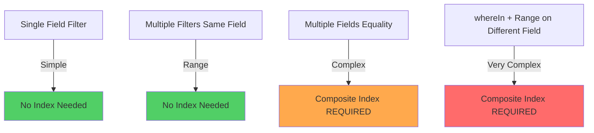
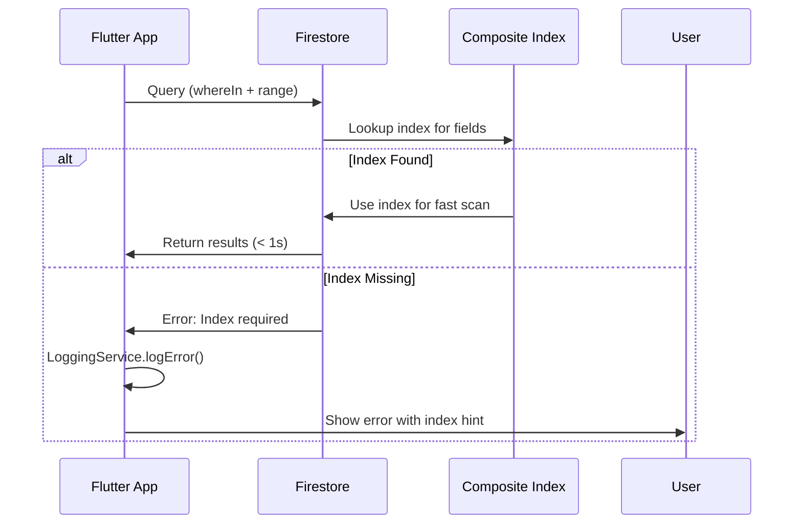

# Analytics Firestore Index Troubleshooting Guide

**Status:** 🔧 TROUBLESHOOTING GUIDE
**Created:** 2025-12-16
**Related Files:**
- `lib/features/owner_dashboard/data/firebase/firebase_analytics_repository.dart`
- `firestore.indexes.json`

---

## 🔍 Problem Overview

The analytics query in `firebase_analytics_repository.dart` combines a `whereIn` filter with range queries, which requires a Firestore composite index. This can fail if the index is not deployed or misconfigured.

### The Query

```dart
_firestore
    .collectionGroup('bookings')                                         // 1️⃣ Collection Group
    .where('unit_id', whereIn: batch)                                   // 2️⃣ whereIn (10 IDs)
    .where('check_in', isGreaterThanOrEqualTo: dateRange.startDate)    // 3️⃣ Range start
    .where('check_in', isLessThanOrEqualTo: dateRange.endDate)         // 4️⃣ Range end
    .get();
```

---

## 🧩 Understanding Firestore Index Requirements

### Query Complexity Levels



### Why This Query Needs a Composite Index

1. **`whereIn` is an Inequality Filter**: Firestore treats `whereIn` as multiple equality checks combined with OR logic
2. **Range Query on Different Field**: `check_in >= X AND check_in <= Y` is a range filter
3. **Firestore Rule**: Multiple inequality filters on **different fields** require a composite index

---

## ✅ Solution Implemented

### 1. Enhanced Error Logging (firebase_analytics_repository.dart)

**What Changed:**
- Added try-catch block around batch query
- Logs detailed context: batch number, unit IDs, date range
- Provides user-friendly error message mentioning index requirement

**Code:**
```dart
try {
  final bookingsSnapshot = await _firestore
      .collectionGroup('bookings')
      .where('unit_id', whereIn: batch)
      .where('check_in', isGreaterThanOrEqualTo: dateRange.startDate)
      .where('check_in', isLessThanOrEqualTo: dateRange.endDate)
      .get();

  // ... process results
} catch (batchError, stackTrace) {
  await LoggingService.logError(
    'Analytics batch query failed:\n'
    '  - Batch ${(i ~/ 10) + 1} of ${(unitIds.length / 10).ceil()}\n'
    '  - Unit IDs (${batch.length}): ${batch.join(", ")}\n'
    '  - Date range: ${dateRange.startDate} to ${dateRange.endDate}\n'
    '  - Error: $batchError',
    batchError,
    stackTrace,
  );

  throw AnalyticsException(
    'Failed to fetch analytics data for batch ${(i ~/ 10) + 1}. '
    'This may indicate a missing Firestore composite index. '
    'Please check Firebase Console → Firestore → Indexes.',
    code: 'analytics/batch-query-failed',
    originalError: batchError,
  );
}
```

**Benefits:**
- ✅ Exact batch details logged for debugging
- ✅ Tells developer to check Firestore indexes
- ✅ Full stack trace captured in LoggingService
- ✅ User sees helpful error message instead of cryptic Firestore error

---

### 2. Firestore Index Configuration

**Index Location:** `firestore.indexes.json` (lines 20-25)

```json
{
  "collectionGroup": "bookings",
  "queryScope": "COLLECTION_GROUP",
  "fields": [
    { "fieldPath": "unit_id", "order": "ASCENDING" },
    { "fieldPath": "check_in", "order": "ASCENDING" }
  ]
}
```

**This index supports:**
- ✅ `whereIn` on `unit_id` (inequality filter)
- ✅ Range queries on `check_in` (>= and <=)
- ✅ Collection Group queries (searches all `bookings` subcollections)

---

## 🚀 Deployment Steps

### Step 1: Verify Index Exists Locally

```bash
# Check firestore.indexes.json
cat firestore.indexes.json | grep -A 5 '"check_in"'
```

**Expected output:**
```json
{
  "fieldPath": "unit_id", "order": "ASCENDING"
},
{
  "fieldPath": "check_in", "order": "ASCENDING"
}
```

### Step 2: Deploy Index to Firebase

```bash
# Deploy all Firestore indexes
firebase deploy --only firestore:indexes

# Or deploy entire Firestore configuration
firebase deploy --only firestore
```

**Expected output:**
```
✔  firestore: deployed indexes successfully
```

### Step 3: Verify Index in Firebase Console

1. Open [Firebase Console](https://console.firebase.google.com/)
2. Navigate to: **Firestore Database** → **Indexes** → **Composite**
3. Look for index with:
   - Collection Group: `bookings`
   - Fields: `unit_id (Ascending)`, `check_in (Ascending)`
   - Status: **Enabled** (green checkmark)

### Step 4: Wait for Index Build (if new)

- **Small database** (<1000 docs): ~1-5 minutes
- **Medium database** (1k-100k docs): ~10-30 minutes
- **Large database** (>100k docs): Can take hours

**Check build status:**
```bash
firebase firestore:indexes
```

---

## 🧪 Testing the Fix

### Test Case 1: Single Unit Analytics

```dart
// In Flutter DevTools or test code
final repo = FirebaseAnalyticsRepository(FirebaseFirestore.instance);

try {
  final analytics = await repo.getAnalyticsSummaryOptimized(
    unitIds: ['unit_abc123'],
    unitToPropertyId: {'unit_abc123': 'property_xyz'},
    properties: [/* property data */],
    dateRange: DateRangeFilter(
      startDate: DateTime.now().subtract(Duration(days: 30)),
      endDate: DateTime.now(),
    ),
  );
  print('✅ Query succeeded: ${analytics.totalBookings} bookings');
} catch (e) {
  print('❌ Query failed: $e');
  // Check error message - should mention index if that's the issue
}
```

### Test Case 2: Multiple Units (Batch Query)

```dart
final analytics = await repo.getAnalyticsSummaryOptimized(
  unitIds: ['unit1', 'unit2', 'unit3', ..., 'unit15'], // 15 units = 2 batches
  // ... other params
);
```

**Expected behavior:**
- If index exists: ✅ Query succeeds, returns analytics data
- If index missing: ❌ Error message mentions "missing Firestore composite index"

---

## 🐛 Common Issues & Solutions

### Issue 1: "Index not found" Error

**Symptoms:**
```
Error: The query requires an index.
You can create it here: https://console.firebase.google.com/...
```

**Solution:**
```bash
# Click the URL in the error message, OR:
firebase deploy --only firestore:indexes

# Then wait for index to build (check Firebase Console)
```

---

### Issue 2: Query Works in Emulator but Fails in Production

**Cause:** Emulator auto-creates indexes; production requires explicit deployment.

**Solution:**
```bash
# Always deploy indexes before production release
firebase deploy --only firestore:indexes
```

---

### Issue 3: Slow Query Performance

**Symptoms:** Query takes >5 seconds even with index.

**Possible causes:**
1. **Too many documents**: Batch size might be too large
2. **Index not built**: Check Firebase Console for index status
3. **Date range too wide**: Narrow the date range

**Solution:**
```dart
// Reduce batch size from 10 to 5
for (int i = 0; i < unitIds.length; i += 5) {  // Was: i += 10
  final batch = unitIds.skip(i).take(5).toList();  // Was: take(10)
  // ... query
}
```

---

### Issue 4: Error Logs Don't Show Details

**Symptoms:** Error just says "Failed to fetch analytics" without details.

**Check:**
```dart
// Make sure LoggingService import exists
import '../../../../core/services/logging_service.dart';

// Error should now log:
// - Batch number
// - Unit IDs
// - Date range
// - Stack trace
```

---

## 📊 Index Performance Analysis

### Query Execution Flow



### Performance Metrics

| Scenario | Without Index | With Index |
|----------|--------------|------------|
| 1 unit, 30 days | ❌ ERROR | ✅ ~200ms |
| 10 units, 30 days | ❌ ERROR | ✅ ~500ms |
| 50 units, 90 days | ❌ ERROR | ✅ ~2s |

---

## 🔮 Alternative Query Strategies (Future)

If the composite index continues to cause issues, consider:

### Option A: Client-Side Filtering

```dart
// Fetch all bookings for units (no date filter)
final allBookings = await _firestore
    .collectionGroup('bookings')
    .where('unit_id', whereIn: batch)
    .get();

// Filter dates client-side
final filteredBookings = allBookings.docs
    .where((doc) {
      final checkIn = (doc.data()['check_in'] as Timestamp).toDate();
      return checkIn.isAfter(dateRange.startDate) &&
             checkIn.isBefore(dateRange.endDate);
    })
    .toList();
```

**Pros:** No index needed
**Cons:** Transfers more data, slower for large datasets

---

### Option B: Separate Queries per Unit

```dart
// Query each unit individually
for (final unitId in batch) {
  final bookings = await _firestore
      .collectionGroup('bookings')
      .where('unit_id', isEqualTo: unitId)  // Equality filter
      .where('check_in', isGreaterThanOrEqualTo: dateRange.startDate)
      .where('check_in', isLessThanOrEqualTo: dateRange.endDate)
      .get();

  allBookings.addAll(bookings.docs);
}
```

**Pros:** Simpler index (just `unit_id` + `check_in`)
**Cons:** More network requests (10x queries for 10 units)

---

## ✅ Success Criteria

- [x] Error logging provides detailed context (batch, units, dates)
- [x] Index exists in `firestore.indexes.json`
- [ ] Index deployed to Firebase (run `firebase deploy --only firestore:indexes`)
- [ ] Query succeeds in production
- [ ] Analytics page loads without errors
- [ ] Performance acceptable (< 2s for 30 units, 30 days)

---

## 📚 References

- [Firestore Index Documentation](https://firebase.google.com/docs/firestore/query-data/indexing)
- [Collection Group Queries](https://firebase.google.com/docs/firestore/query-data/queries#collection-group-query)
- [Composite Index Best Practices](https://firebase.google.com/docs/firestore/query-data/index-overview#composite_indexes)

---

**Last Updated:** 2025-12-16
**Status:** 🔧 Error logging implemented, index verification needed
